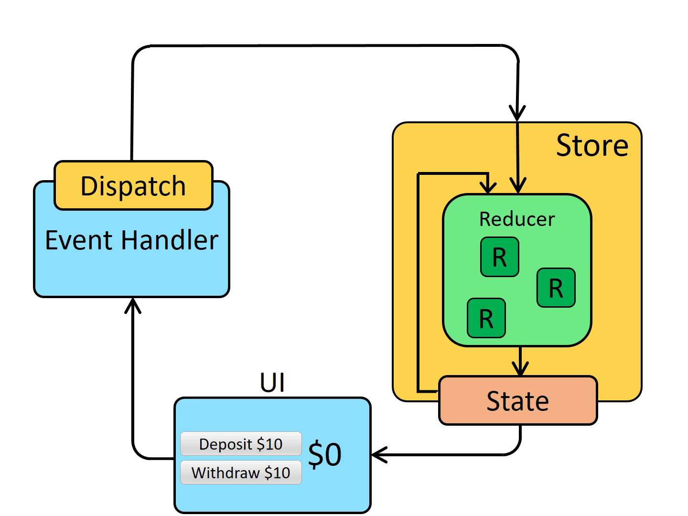

# Giới thiệu về Redux

## Redux là gì?

- **Redux** là một thư viện giúp chúng ta quản lý các state của app trong React một cách dễ dàng.
- **Redux** có một `store` duy nhất lưu trữ các `state` của app. Mỗi component có thể truy cập trực tiếp đến `state` được lưu trữ thay vì phải send drop down props từ component này đến component khác.
- **Redux** tương tự như sự kết hợp giữa `useReducer` và `useContext` trong React

## Quy trình hoạt động của Redux



- Ở khối **Event Handler** , khi người dùng thực hiện một event (như click button), ta sẽ dispatch action (gửi đi một action).
- **Action** sau đó sẽ được gửi đến `reducer` để thay đổi `state`
- `State` được lưu trữ trong `store` có thể được lấy ra để render ra UI

## Cài đặt

- Trong thư mục dự án, mở terminal lên và gõ lệnh:

```bash
npm install react-redux @reduxjs/toolkit
```
