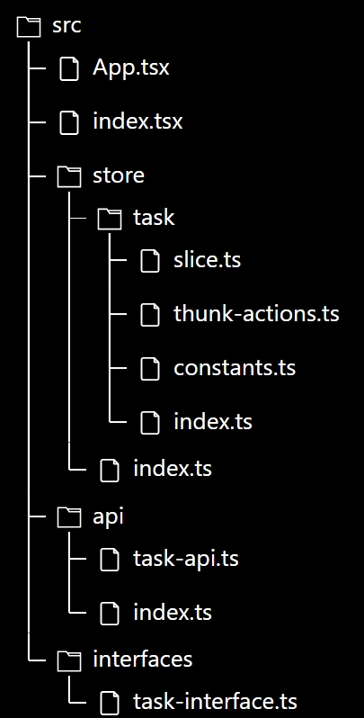

# Ví dụ về Redux thunk

- Ví dụ nhỏ dưới đây mô tả việc sử dụng Redux thunk sử dụng TypeScript



```ts title="src/interfaces/task-interface.ts"
export interface ITask {
  id: number;
  name: string;
  isCompleted: boolean;
}
```

```ts title="src/api/task-api.ts"
import axios from "axios";
import { ITask } from "../interfaces/task-interface";

export const getAllTasks = async () => {
  const { data } = await axios.get<ITask[]>(
    "https://6404cc9280d9c5c7bad0e2f2.mockapi.io/api/v1/tasks"
  );
  return data;
};

export const getTaskById = async (id: number) => {
  const { data } = await axios.get<ITask>(
    `https://6404cc9280d9c5c7bad0e2f2.mockapi.io/api/v1/tasks/${id}`
  );
  return data;
};

export const updateTaskById = async (id: number, body: ITask) => {
  const { data } = await axios.put<ITask>(
    `https://6404cc9280d9c5c7bad0e2f2.mockapi.io/api/v1/tasks/${id}`,
    body
  );
  return data;
};

export const deleteTaskById = async (id: number) => {
  const { data } = await axios.delete<ITask>(
    `https://6404cc9280d9c5c7bad0e2f2.mockapi.io/api/v1/tasks/${id}`
  );
  return data;
};
```

```ts title="src/api/index.ts"
import * as taskApi from "./task-api";

export { taskApi };
```

```ts title="src/store/task/constants.ts"
export enum ETaskThunkActions {
  GET_ALL_TASKS = "GET_ALL_TASKS",
  GET_TASK_BY_ID = "GET_TASK_BY_ID",
  UPDATE_TASK_BY_ID = "UPUPDATE_TASK_BY_ID",
  DELETE_TASK_BY_ID = "DELETE_TASK_BY_ID",
}
```

```ts title="src/store/task/thunk-actions.ts"
import { createAsyncThunk } from "@reduxjs/toolkit";
import { ETaskThunkActions } from "./constants";
import { taskApi } from "../../api";
import { ITask } from "../../interfaces/task-interface";

export const getAllTasks = createAsyncThunk(
  ETaskThunkActions.GET_ALL_TASKS,
  async (_, { rejectWithValue }) => {
    try {
      const response = await taskApi.getAllTasks();
      return response;
    } catch (error) {
      return rejectWithValue(error);
    }
  }
);

export const getTaskById = createAsyncThunk(
  ETaskThunkActions.GET_TASK_BY_ID,
  async (id: number, { rejectWithValue }) => {
    try {
      const response = await taskApi.getTaskById(id);
      return response;
    } catch (error) {
      return rejectWithValue(error);
    }
  }
);

export const updateTaskById = createAsyncThunk(
  ETaskThunkActions.UPDATE_TASK_BY_ID,
  async (body: ITask, { rejectWithValue }) => {
    try {
      const response = await taskApi.updateTaskById(body.id, body);
      return response;
    } catch (error) {
      return rejectWithValue(error);
    }
  }
);

export const deleteTaskById = createAsyncThunk(
  ETaskThunkActions.DELETE_TASK_BY_ID,
  async (id: number, { rejectWithValue }) => {
    try {
      const response = await taskApi.deleteTaskById(id);
      return response;
    } catch (error) {
      return rejectWithValue(error);
    }
  }
);
```

```ts title="src/store/task/slice.ts"
import { createSlice } from "@reduxjs/toolkit";
import * as taskThunkActions from "./thunk-actions";
import type { ITask } from "../../interfaces/task-interface";

interface ITaskState {
  taskList: ITask[];
}

const initialState: ITaskState = {
  taskList: [],
};

const taskSlice = createSlice({
  name: "task",
  initialState,
  reducers: {},
  extraReducers: (builder) => {
    builder
      .addCase(taskThunkActions.getAllTasks.fulfilled, (state, action) => {
        state.taskList = action.payload;
      })
      .addCase(taskThunkActions.updateTaskById.fulfilled, (state, action) => {
        const updatedTask = action.payload;
        const newTaskList = state.taskList.map((task) =>
          task.id === updatedTask.id ? updatedTask : task
        );
        state.taskList = newTaskList;
      })
      .addCase(taskThunkActions.deleteTaskById.fulfilled, (state, action) => {
        const deletedTask = action.payload;
        const newTaskList = state.taskList.filter(
          (task) => task.id !== deletedTask.id
        );
        state.taskList = newTaskList;
      });
  },
});

export default taskSlice;
```

```ts title="src/store/task/index.ts"
import taskSlice from "./slice";
import * as taskThunkActions from "./thunk-actions";

const taskActions = taskSlice.actions;
const taskReducer = taskSlice.reducer;
export { taskActions, taskThunkActions, taskReducer };
```

```ts title="src/store/index.ts"
import { configureStore } from "@reduxjs/toolkit";
import { TypedUseSelectorHook, useDispatch, useSelector } from "react-redux";
import { taskReducer } from "./task";

export const store = configureStore({
  reducer: {
    task: taskReducer,
  },
  middleware: (getDefaultMiddleware) =>
    getDefaultMiddleware({ serializableCheck: false }),
});

type AppDispatch = typeof store.dispatch;
export type RootState = ReturnType<typeof store.getState>;
export const useAppDispatch = () => useDispatch<AppDispatch>();
export const useAppSelector: TypedUseSelectorHook<RootState> = useSelector;
```

- Ta có thể dispatch một thunk action từ một component bất kỳ như sau:

```ts
const dispatch = useAppDispatch();

interface ErrorResponse {
  message: string;
}

try {
  //Sử dụng phương thức unwrap() để lấy dữ liệu trả về (nếu có) khi thực hiện xong một thunk action
  const response = await dispatch(taskThunkActions.getAllTasks()).unwrap();
} catch (e) {
  const error = e as AxiosError<ErrorResponse>;
  console.log(error.response?.data); // Lấy dữ liệu lỗi mà server trả về
}
```
