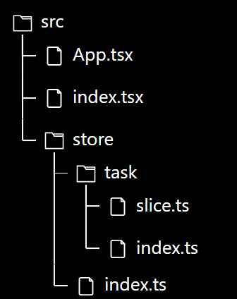

# Ví dụ về Redux Toolkit

- Ví dụ nhỏ dưới đây mô tả việc sử dụng Redux trong React, dùng TypeScript



```ts title="src/store/task/slice.ts"
import { createSlice } from "@reduxjs/toolkit";
import type { PayloadAction } from "@reduxjs/toolkit";

interface Task {
  name: string;
  isCompleted: boolean;
}

const initialState: { taskList: Task[] } = {
  taskList: [],
};

const taskSlice = createSlice({
  name: "task",
  initialState,
  reducers: {
    addTask: (state, action: PayloadAction<Task>) => {
      state.taskList.push(action.payload);
    },
    deleteTask: (state, action: PayloadAction<number>) => {
      state.taskList.splice(action.payload, 1);
    },
  },
});

export default taskSlice;
```

```ts title="src/store/task/index.ts"
import taskSlice from "./slice";

const taskActions = taskSlice.actions;
const taskReducer = taskSlice.reducer;

export { taskActions, taskReducer };
```

```ts title="src/store/index.ts"
import { configureStore } from "@reduxjs/toolkit";
import { TypedUseSelectorHook, useDispatch, useSelector } from "react-redux";
import { taskReducer } from "./task";

export const store = configureStore({
  reducer: {
    task: taskReducer,
  },
});
type AppDispatch = typeof store.dispatch;
export type RootState = ReturnType<typeof store.getState>;
export const useAppDispatch = () => useDispatch<AppDispatch>();
export const useAppSelector: TypedUseSelectorHook<RootState> = useSelector;
```

```tsx title="src/App.tsx"
import { useState } from "react";
import { useAppSelector, useAppDispatch } from "./store";
import { taskActions } from "./store/task";

export default function App() {
  const dispatch = useAppDispatch();
  const { taskList } = useAppSelector((state) => state.task);
  const [name, setName] = useState("");

  const handleAddTask = () => {
    dispatch(
      taskActions.addTask({
        name,
        isCompleted: false,
      })
    );
  };

  return (
    <div>
      <input
        type="text"
        value={name}
        onChange={(e) => setName(e.target.value)}
      />
      <button onClick={handleAddTask}>Add new task</button>
      <ul>
        {taskList.map((task, index) => (
          <li key={index}>
            <span>{task.name}</span>
            <button onClick={() => dispatch(taskActions.deleteTask(index))}>
              Delete
            </button>
          </li>
        ))}
      </ul>
    </div>
  );
}
```

```tsx title="src/index.tsx"
import { createRoot } from "react-dom/client";
import App from "./App";
import { Provider } from "react-redux";
import { store } from "./store";

const rootElement = document.getElementById("root");
const root = createRoot(rootElement!);

root.render(
  <Provider store={store}>
    <App />
  </Provider>
);
```
